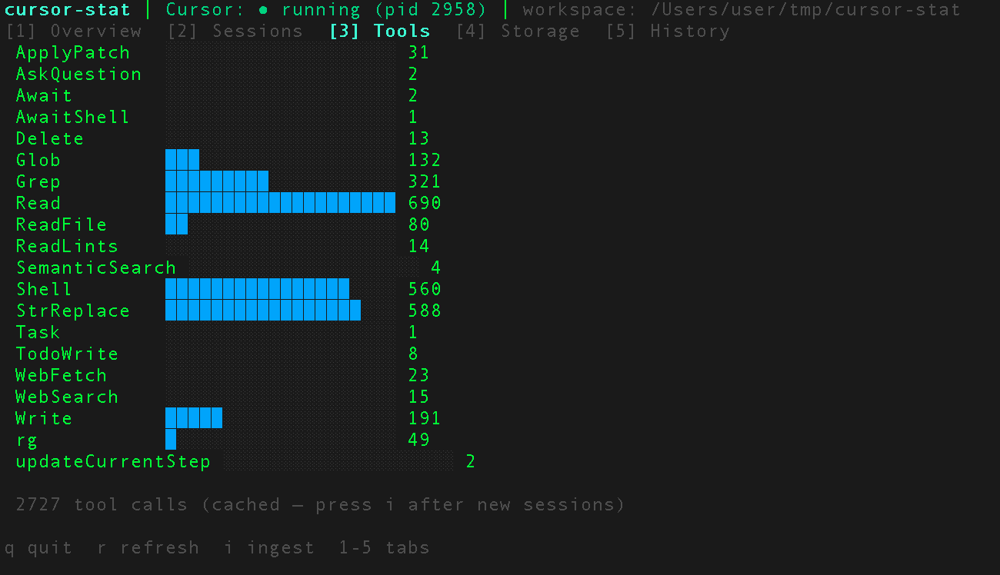
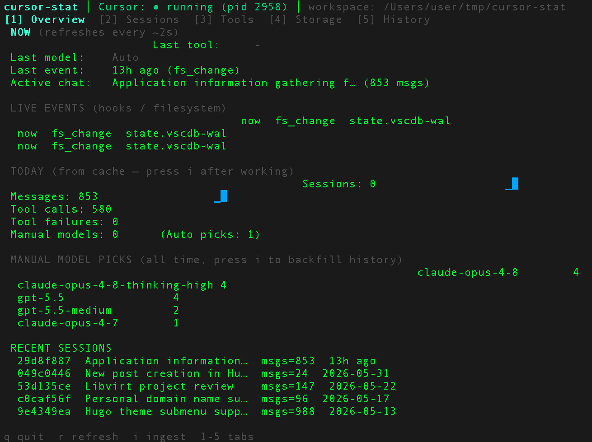

# cursor-stat

**cursor-stat** is a **top-like terminal dashboard** for [Cursor IDE](https://cursor.com). It reads locally stored Cursor data and live activity signals, then shows **what is happening now**, **usage statistics**, and **historical trends** — all from your machine, with no cloud dependency.

> **Status:** TUI, ingest cache, live hooks, model tracking, doctor, and export are implemented. See [docs/USER-GUIDE.md](docs/USER-GUIDE.md).

## Screenshots





## Quick start

```bash
go run ./cmd/cursor-stat              # interactive TUI (default)
go run ./cmd/cursor-stat --once       # JSON snapshot to stdout
go run ./cmd/cursor-stat ingest       # backfill ~/.cursor-stat/stats.db
go run ./cmd/cursor-stat doctor       # diagnostic checks
go run ./cmd/cursor-stat export --format csv --days 30
go run ./cmd/cursor-stat hooks install  # optional live hook events
go test ./...
```

### First run

1. `cursor-stat ingest` — builds local cache from Cursor SQLite + transcripts  
2. `cursor-stat` — opens the dashboard (press `i` to re-ingest anytime)  
3. Optional: `cursor-stat hooks install` for sub-second live tool events  

**Model tracking:** With hooks installed, each chat/agent prompt records the `model` field from Cursor’s `beforeSubmitPrompt` hook. **Auto** shows as `default`; any other value is counted as a **manual** model pick. Press `i` to backfill historical manual picks from Cursor bubble data (best effort).

### Environment overrides

| Variable | Purpose |
|----------|---------|
| `CURSOR_USER_DATA` | Force Cursor `User` directory |
| `CURSOR_STAT_HOME` | Force cache dir (default `~/.cursor-stat`) |
| `CURSOR_STAT_HOOK_PORT` | Live hook HTTP port (default `23556`) |

## Commands

| Command | Description |
|---------|-------------|
| *(default)* | Full-screen TUI with tabs 1–5 |
| `--once` | One-shot JSON snapshot (no cache required) |
| `ingest` | Idempotent backfill into `stats.db` |
| `doctor` | Path, DB, cache, and hook checks |
| `export` | CSV or JSON rollups (`--format`, `--days`, `-o`) |
| `hooks install` | Append marker hook to `~/.cursor/hooks.json` |

### TUI keys

| Key | Action |
|-----|--------|
| `q` | Quit |
| `r` | Refresh |
| `i` | Run ingest |
| `1`–`5` | Tabs: Overview, Sessions, Tools, Storage, History (see [USER-GUIDE.md](docs/USER-GUIDE.md)) |

## Documentation

| Document | Purpose |
|----------|---------|
| [docs/USER-GUIDE.md](docs/USER-GUIDE.md) | **User guide** — tabs, ingest, hooks, models, troubleshooting |
| [docs/NOVICE-GUIDE.md](docs/NOVICE-GUIDE.md) | **Go beginner guide** — how the codebase fits together |
| [docs/ARCHITECTURE.md](docs/ARCHITECTURE.md) | Modules, data flow, schema |
| [docs/DATA-SOURCES.md](docs/DATA-SOURCES.md) | Cursor local data inventory |

## Architecture (short)

```text
Cursor files (state.vscdb, transcripts, hooks)
        │
        ├─ ingest ──► ~/.cursor-stat/stats.db (cache + rollups)
        │
        ├─ live watcher / hook server ──► ring buffer
        │
        └─ aggregate ──► TUI / --once JSON / export
```

## Design principles

1. **Local-only** — no cloud, no account API  
2. **Read-mostly** — never modifies Cursor databases  
3. **Cache-first TUI** — refresh reads `stats.db`, not full re-parse  
4. **Graceful degradation** — missing paths show doctor hints  

## License

TBD.
